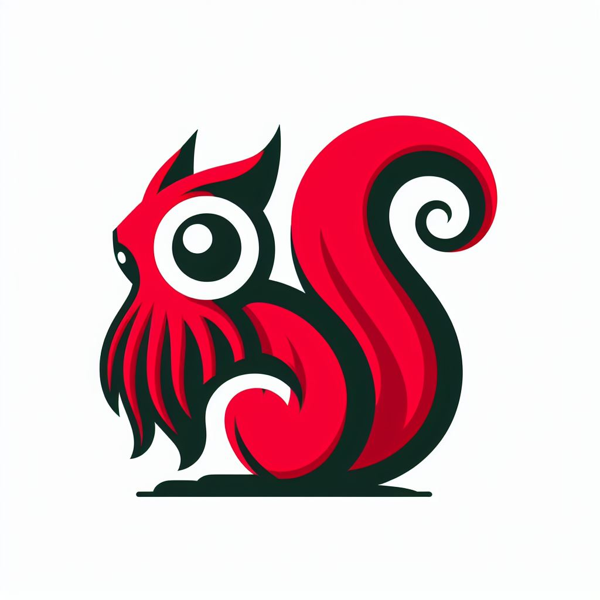

# Sqyrrl - an HTTP server for files hosted in iRODS



Sqyrrl is an HTTP server which contains an embedded iRODS client and is able to
serve data directly from iRODS.

## Installation

Sqyrrl is a available as and `amd64` binary for Linux, macOS and Windows,
or as a Docker image. Copy the file to the desired location and run it.

## Limitations

Sqyrrl is an early development version and has the following limitations:

- Does not authenticate users to the HTTP endpoint; anyone can access the data it serves.
- Only serves files that have public access in iRODS.

## Running Sqyrrl

Sqyrrl authenticates to iRODS using the standard method for an iRODS client i.e.
using the iRODS environment file. It respects the `IRODS_ENVIRONMENT_FILE` environment
variable, and if that is not set, it will look for the file in the standard location
`$HOME/.irods/irods_environment.json`. Alternatively, command line option `--irods-env`
may be used to set the environment file location explicitly.

Since Sqyrrl will serve any data that it can access, it's important to use an iRODS user
with appropriate authorization. The chosen iRODS user should have access only to public
(unrestricted) data.

To start the server, use the following command:

```sh
Usage:
  sqyrrl start [flags]

Flags:
      --cert-file string          Path to the SSL certificate file
  -h, --help                      help for start
      --host string               Address on which to listen, host part (default "localhost")
      --index-interval duration   Interval at which update the index (default 1m0s)
      --irods-env string          Path to the iRODS environment file (default "/Users/kdj/.irods/irods_environment.json")
      --key-file string           Path to the SSL private key file
      --port string               Port on which to listen (default "3333")

Global Flags:
      --log-level string   Set the log level (trace, debug, info, warn, error) (default "info")

```

To stop the server, send `SIGINT` or `SIGTERM` to the process. The server will wait for
active connections to close before shutting down.

For additional options, use the `--help` flag.

## Authentication - WARNING: This feature is not yet fully implemented

Sqyrrl supports OpenID Connect for authentication. To enable OpenID Connect, use the
`--enable-oidc` flag. The following environment variables are then required:

- `OIDC_CLIENT_ID` - the client ID for the OIDC provider
- `OIDC_CLIENT_SECRET` - the client secret for the OIDC provider
- `OIDC_ISSUER_URL` - the URL of the OIDC provider

Sqyrrl will then redirect users to the OIDC provider for authentication. The user will be
redirected back to Sqyrrl after authentication.

**Currently this feature does nothing more than enable the Login / Logout buttons on the
home page.**

## iRODS authentication

Sqyrrl uses the standard iRODS environment file to authenticate to iRODS. If the user has been
authenticated with `iinit` before starting Sqyrrl, the server will use the existing iRODS auth
file created by `iinit`. If the user has not been authenticated, Sqyrrl will require the iRODS
password to be supplied using the environment variable `IRODS_PASSWORD`. Sqyrrl will then create
the iRODS auth file itself, without requiring `iinit` to be used.

## Running in a container

When running Sqyrrl in a Docker container, configuration files (iRODS environment file, any
existing auth file, SSL certificates) should be mounted into the container.

The docker-compose.yml file in the repository contains an example configuration for running
Sqyrrl in a container.

## Tagging iRODS data objects for display on the home page

This is an experimental feature. It allows the user to tag iRODS data objects with metadata so
that they will be displayed in the Sqyrrl home page for convenience. To tag an iRODS data object,
add a metadata attribute `sqyrrl:index` with value `1`. Data objects may be  grouped together
on the page, under a title, known as a "category". To specify a category for a data object,
add a metadata attribute `sqyrrl:category` with the  value being the category name.

The home page will be re-indexed at the interval specified by the `--index-interval` flag. The
home page auto-refreshes every 30 seconds.

N.B. As go-irodsclient does not support metadata queries across federated zones, this feature
is limited to data objects in the same zone as the iRODS user.

## Dependencies

Sqyrrl uses [go-irodsclient](https://github.com/cyverse/go-irodsclient) to connect to iRODS. 

